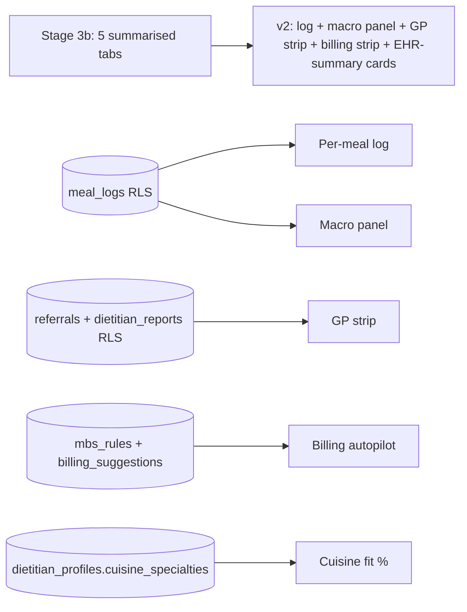

# Patient Detail v2 — Nutrium-style, Measured-shaped

The Stage 3b `/d/patients/[id]` was correct in structure (5 tabs, snapshot, plan, reports). It is **too summarised** for the day-to-day dietitian sweep — Nutrium's strength is a per-meal log with live macros, where the dietitian can edit a portion and watch the daily energy/protein/carb/fat/fibre bars move. We'll port that ergonomic core into Measured, but with **four deliberate departures** that protect Measured's positioning as a coordination layer, not an EHR.

## What we keep from Nutrium

1. **Per-meal expanded log.** Each meal collapses to a one-line summary with time + macro mini-bars; expanded shows ingredient rows, each editable, with running totals.
2. **Macro side panel.** Energy / Protein / Carbs / Fat / Fibre with `value / target` bars and a donut chart for the current day's distribution.
3. **Day strip.** Breakfast → Lunch → Dinner → Snack at the bottom of the macro panel as quick anchors that scroll the log.
4. **Two-pane layout.** Left = log (60%), right = macro panel (40%) on desktop. Mobile collapses macro panel into a sticky bottom sheet.
5. **Daily / weekly toggle.** Same log, weekly average roll-up.

## What Measured does differently — four departures

### 1. Cuisine-fit is a first-class field, not a free-text note

Nutrium's "Notes" become structured cuisine-fit tags (`south_asian`, `east_asian`, `mediterranean`, etc.) bound to the patient's `cuisine_pref` and the dietitian's `dietitian_profiles.cuisine_specialties`. Every meal entry shows a small cuisine chip; if the entry's cuisine doesn't match the patient's preference, the chip turns into an amber soft-warning ("Outside Asha's south-Asian preference — swap?"). The patient profile header shows a **Cuisine fit %** between patient and assigned dietitian, computed from the intersection of both sets.

### 2. GP coordination strip — pinned above the log

A **single horizontal strip** sits above the meal log (8 px tall), not buried in a tab. It shows:

```
[Last GP report sent · 4 days ago]   [Next GP review due · in 9 days]   [Open GP transcript →]   [Send draft to Dr Lee →]
```

Click "Send draft to Dr Lee" → fires the existing `report.requested` Inngest worker, opens the dietitian-report draft in a slide-over, dietitian approves once, audit row written, PDF route streams to the GP's email. **Three taps from the patient detail to a GP-readable PDF.** This is the only place a dietitian needs to think about coordination — not a separate "Reports" tab, not the Composer, not the Queue.

### 3. Billing autopilot

Below the GP strip, a one-line **Billing autopilot** banner only appears when an MBS item becomes claimable (10/yr DAA, group, follow-up). The dietitian sees:

```
[Eligible: MBS 10954 — Initial DAA · auto-prepared · review and send to Dr Lee →]
```

Click → a slide-over confirms the rationale (linked to PRD `mbs_rules` row), the audit log gains a `billing.suggested` row, and the GP's `/gp/[patientId]/billing` card receives the suggestion in real-time. **The dietitian never types an item number.**

### 4. Coordination, not replacement — explicit empty states

Wherever Nutrium has full editable EHR sections (medications, allergies, lab values), Measured shows a **read-only summary with an "open in GP record" link**:

```
Medications (synced from GP record · last sync 2h ago) [↗ open in clinic system]
- Metformin 500mg BD
- Atorvastatin 20mg nocte
```

We never invite editing of clinical data the GP owns. The link is a deep-link placeholder today (Stage 5b) and a real Best Practice / Heidi handoff later (PRD §5.4 deferred). This makes the "we supplement, don't replace" stance physically visible in the UI.

## Architecture transitions



Five surfaces. None require new tables — the Stage 5a schema already has every column.

## File-level scope

```
src/components/dietitian/screens/patient-detail-v2-screen.tsx     (replaces patient-detail-screen.tsx)
src/components/dietitian/detail/
  meal-log.tsx                          ← collapsible per-meal rows + macro mini-bars
  meal-log-row.tsx                      ← single meal row (expand / portion-edit)
  ingredient-row.tsx                    ← editable ingredient line
  macro-panel.tsx                       ← right-rail energy/protein/carbs/fat/fibre
  macro-donut.tsx                       ← Recharts pie, four slices
  day-strip.tsx                         ← Breakfast/Lunch/Dinner/Snack quick-anchors
  cuisine-fit-chip.tsx                  ← chip + tooltip + amber soft-warning
  gp-strip.tsx                          ← pinned coordination strip
  billing-banner.tsx                    ← autopilot banner (only when MBS triggers)
  ehr-summary-card.tsx                  ← read-only meds/allergies/labs with open-in-GP link

src/lib/engine/
  cuisine-fit.ts                        ← intersection score + amber threshold
  mbs-rule-engine.ts                    ← given patient + visit history, list claimable items
                                          (pure-logic, drives billing-banner)

src/server/services/
  patient-detail.ts                     ← single server fetch returning everything the v2 screen needs
                                          (patient, day's meal_logs+meal_analysis, GP report state, MBS eligibility)

tests/
  cuisine-fit.test.ts                   ← intersection, amber threshold, edge cases
  mbs-rule-engine.test.ts               ← 5 PRD §22 GP claim scenarios
```

## Daily breakdown (one calendar week)

### Mon — Cuisine fit + MBS rule engine (the two pure-logic pieces)

- `cuisine-fit.ts` — set intersection / specialty match score; amber threshold at <50%.
- `mbs-rule-engine.ts` — input `{ patient, visit_history, gp_management_plan_status }`; output ordered list of `{ item_number, rationale, requirements }`. Stage 1 supports five items: 10954 (initial DAA), 10968 (review DAA), 81120 (group session), 723 (TCA contribution), 10997 (chronic disease GP-team item). Pure-logic; reads `mbs_rules` table when configured, falls back to in-code map.
- Tests for both before any UI work.

### Tue — Meal log + ingredient rows + macro panel

- `meal-log.tsx` + `meal-log-row.tsx` + `ingredient-row.tsx` — the three core components. Editing portions live-updates macros (Zustand store scoped to the screen so tabs out / back preserves edits).
- `macro-panel.tsx` + `macro-donut.tsx` (Recharts).
- `day-strip.tsx` — anchored Breakfast/Lunch/Dinner/Snack jump links.

### Wed — GP strip + Billing autopilot + EHR-summary cards

- `gp-strip.tsx` — pinned coordination strip. Reads `dietitian_reports` and `referrals`; "Send draft" button emits `report.requested` event.
- `billing-banner.tsx` — only renders when `mbs-rule-engine` returns at least one item; one click writes a `billing_suggestions` row.
- `ehr-summary-card.tsx` — read-only summary cards with explicit "↗ open in clinic system" links. Three cards: medications, allergies, latest labs.
- `patient-detail.ts` server service — composite fetch returning the entire screen state in one round trip (Supabase or mock).

### Thu — Loop 1 red-team

- Stopwatch a five-meal portion edit + send GP draft + accept billing suggestion in one sweep. Target **<8 minutes for an 8-meal review week**, including GP report draft (PRD §8 implicit target).
- Verify cuisine-fit chip turns amber when an out-of-cuisine entry appears.
- Verify the GP strip is the _only_ place the dietitian sees the coordination action — no duplicate buttons in tabs.
- Verify EHR-summary cards have no editable fields (regression — must reject any dev-mode override).

### Fri — Loop 1 fix

- One commit per finding referencing its loop entry id.

### Sat — Loop 2 edge sweep

- 50-ingredient meal edit (Recharts donut should not flicker; macro panel should re-render under 16 ms).
- Cuisine fit at 0% (Asha assigned to Mediterranean specialist) → patient header shows red soft-warning + suggested re-route to a south-Asian-specialty dietitian.
- MBS rule engine with all five items eligible simultaneously → banner shows top-priority item; "see more" reveals the rest.
- GP report `report.requested` event with provider unconfigured → safety fallback: dietitian gets the editable draft skeleton and a "draft AI is offline; fill manually" copy.
- Multi-tab: edit a portion in tab A, watch tab B reflect via Realtime within 2 s (when env is configured) or storage event (vibe).

### Sun — Loop 2 fix and close

- Final dev-server smoke. Tag this as `v1.1.0-detail-v2`.

## Exit gate

- [ ] `pnpm test` adds ≥10 cells (cuisine-fit + MBS rules) and stays green.
- [ ] `pnpm build` clean, no new TypeScript errors.
- [ ] `pnpm lint` 0/0, Prettier clean.
- [ ] `/d/patients/asha` renders the new layout end-to-end on mocks.
- [ ] Stopwatch evidence: 8-meal review week + GP draft + billing accept under 8 minutes.
- [ ] Cuisine fit < 50% triggers amber chip; < 25% triggers red header banner suggesting re-route.
- [ ] `git tag v1.1.0-detail-v2` after Sun close.

## What this plan deliberately does NOT do

These are _not_ gaps; they are scope guardrails consistent with Measured's positioning:

- **No medication editing.** The GP owns medications; we summarise and link out.
- **No diagnosis entry.** GP-only; surfaced read-only.
- **No allergen database management.** The dietitian flags an allergy on a meal; the master list is GP-managed.
- **No multi-day plan editor inside the detail view.** That stays in the existing `Plan Builder` tab — the detail view is for the _daily review_, not multi-week planning.
- **No PostHog analytics inside this view.** The events are already centralised (Stage 8); call sites are added during the build, not invented per-screen.
- **No Best Practice / Heidi integration.** PRD §5.4 deferred. The "↗ open in clinic system" link is intentionally a placeholder until that integration lands.

## Why this is the right next move (not a vibe scope creep)

1. **Strategic moat.** Cuisine-aware routing is the one thing Nutrium can't trivially copy without rewiring their dietitian onboarding. Surfacing fit % in the Patient Detail makes it visible as a daily ergonomic, not a hidden algorithm.
2. **Dietitian retention.** Nutrium's per-meal log is the muscle-memory dietitians already have. Matching it removes the "but Nutrium does this better" objection without abandoning Measured's coordination thesis.
3. **GP unlock.** A pinned GP strip + billing autopilot turns "this is a dietitian tool" into "this is a coordination tool that pays for itself" — the explicit value prop for the GP-side onboarding.
4. **Frictionless patient experience.** The patient app doesn't change; the entire upgrade is dietitian-side ergonomics. Patient-app simplicity stays untouched.
5. **No EHR creep.** Every Nutrium-equivalent EHR section is explicitly read-only with an outbound link. The team's "we are not the EHR" stance becomes a UI invariant, not a meeting-room promise.
